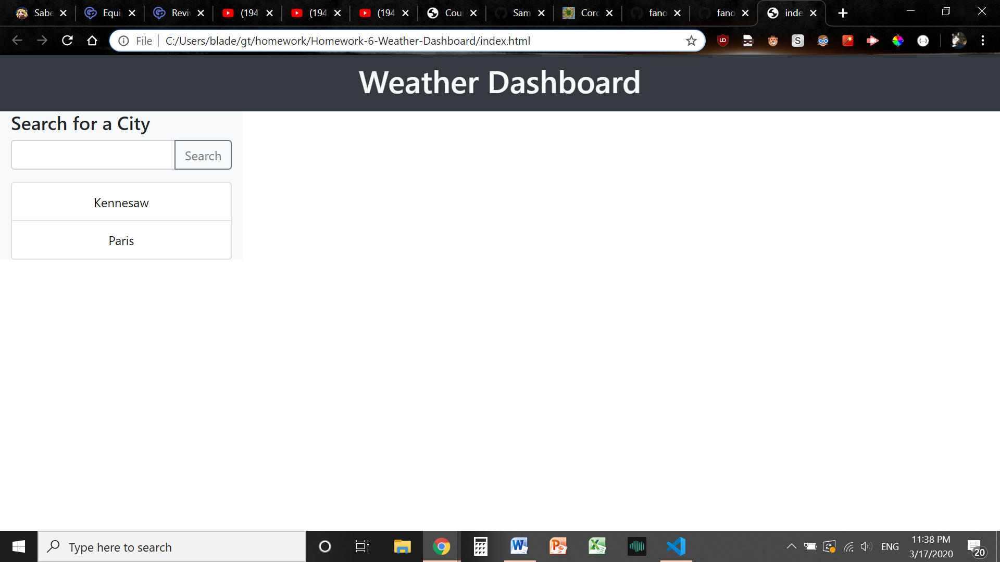
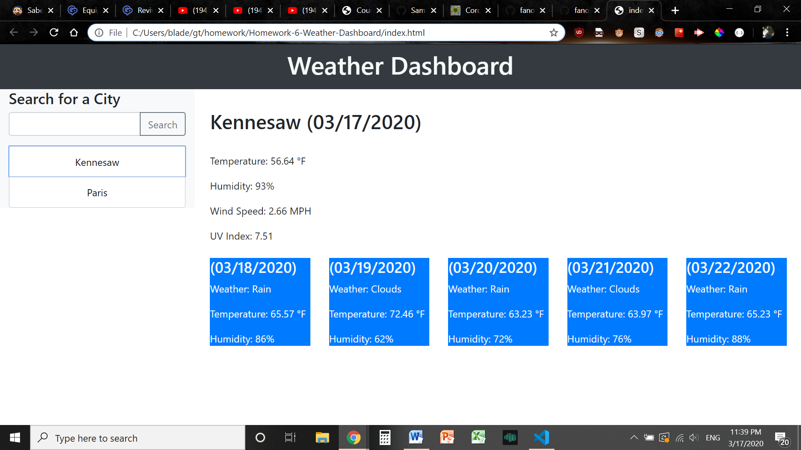

# 06 Server-Side APIs: Weather Dashboard

This program is intended to be used as a Weather Dashboard, meaning that one can view the weather in any city of their choosing simply by typing in the city name into the input form on the top left. Not only will this display the current weather, but also the forecast for the next 5 days thereafter. Finally, searched cities will not be discarded, but instead preserved as buttons on the left for later perusal. 

## Intended Usage

According to the user story that came bundled with this project, the intent of this program is to assist a specific user in planning a trip around the weather conditions of various cities that they'll, presumably, be visiting within the next few days. For once, this program would actually be quite helpful in that regard, albeit in an incredibly roundabout manner. 

## Screenshots

## Features

- Weather data sourced from the OpenWeather API
- Automatically updating dates for all sections, powered by Moment.js
- An automatic saving function that stores to localStorage and retrieves on page load

## Link to Published Page

(https://fanofstuff.github.io/Homework-6-Weather-Dashboard/)

## How to Use

1. Simply open index.html, 
2. Type in the city name of your choice (careful to spell it correctly!), 
3. and profit from the wealth of knowledge that totally isn't right on your phone anyway! 

Close and reopen it - it'll be there for you when you come back! 

## Credits

© 2019 fanofstuff
